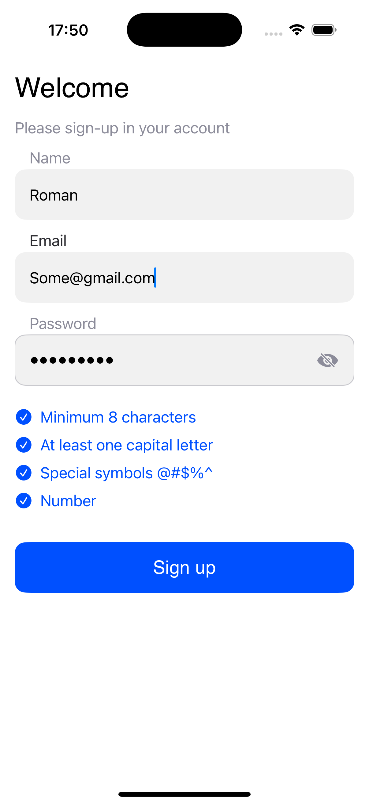

# O2 test app

This is iOS appliction (tesk task) is created as a part of interview for O2 by Roman Holovai at 13.04.2025  
<a href="https://www.figma.com/design/mxRe07vbzbpgXvHHeNuQAb/Zadanie---iOS-Developer?node-id=0-1&t=3nW5okJnvPEesi45-1">HERE</a> you can see basic requirements and design of this project.

# Criteria of app:
- [x] Project created on SwiftUI
- [x] UI created from scratch with elements of design in figma.
- [x] Password input and another elements of UI has a good UX.
- [x] Created password validator.
- [x] Git

# Screenshots iPhone 16 pro:

  
  
  

